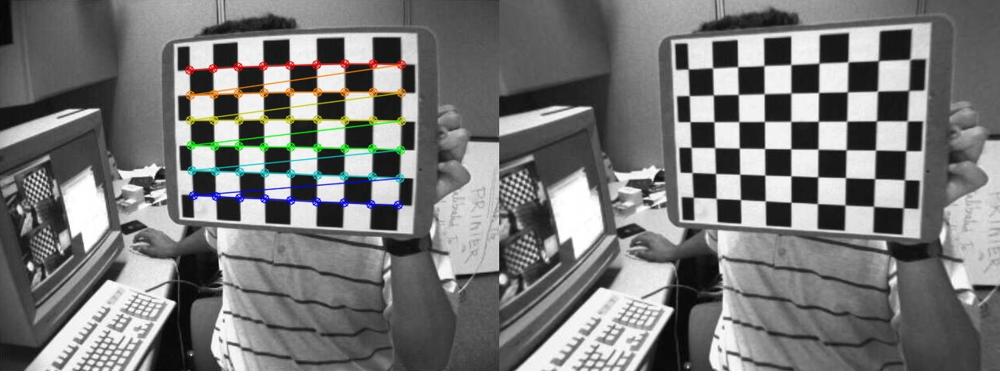
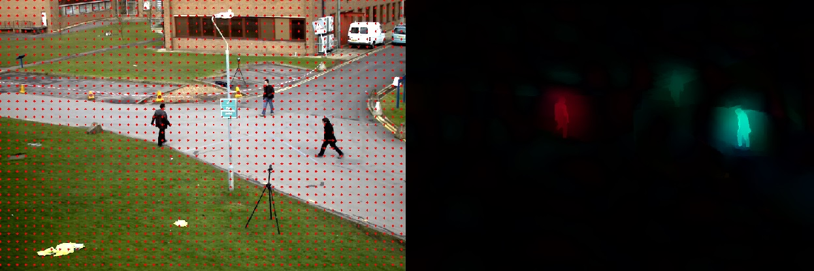
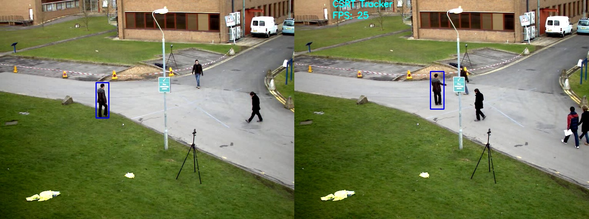
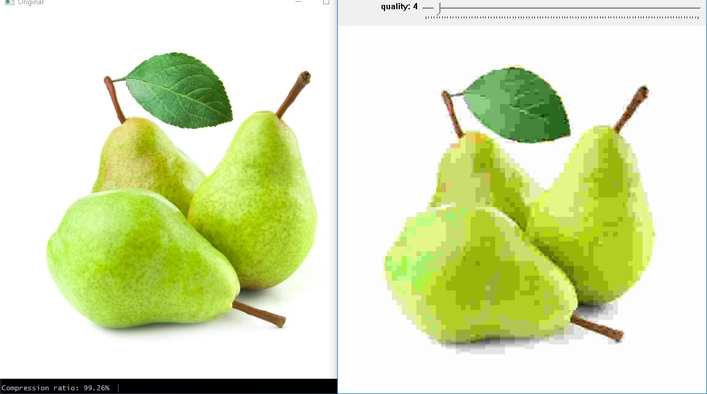
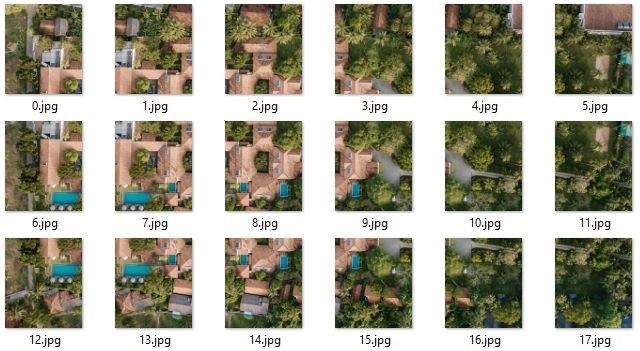
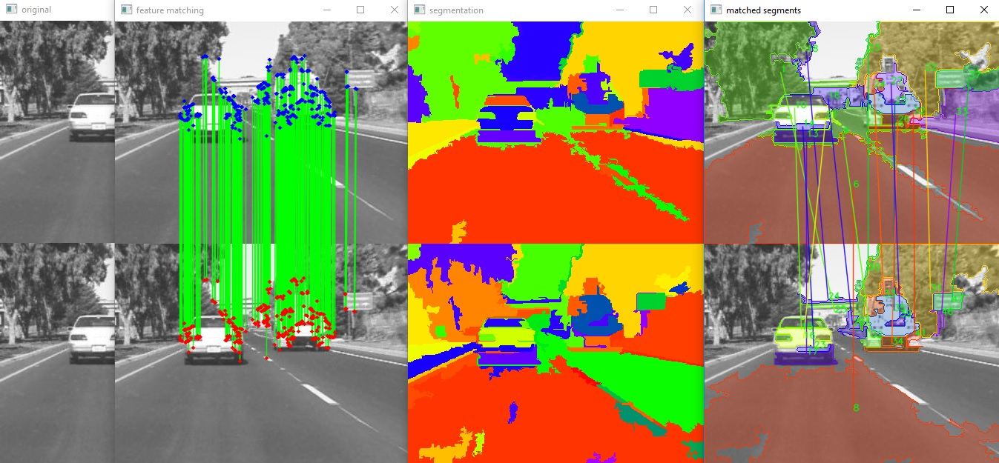
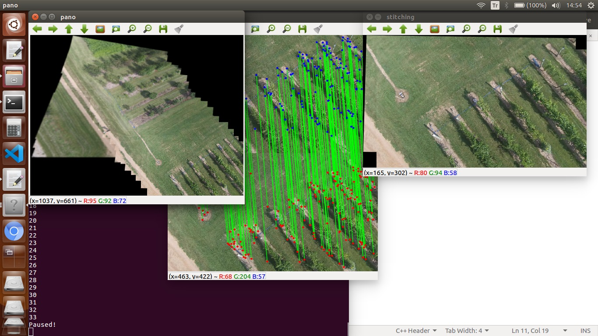

# OpenCV-Projects

Computer vision programs written in C++.

All projects have a cross-platform `CMakeLists.txt`, all of which add `CMakeLists.txt` at the root folder as subdirectory to find OpenCV and to share common code in one place.

- [Calibrate](#Calibrate)
- [general](#general)
  - [optflow](#optflow)
  - [tracker](#tracker)
- [Jpeg](#Jpeg)
- [PictureByParts](#PictureByParts)
- [Segment](#Segment)
- [Stitch](#Stitch)

For contributing, please use [`git-clang-format`](https://reviews.llvm.org/source/llvm-github/browse/main/clang/tools/clang-format/git-clang-format) to indent the code, which is available at the root folder in this repository.

    $ git clang-format *

Consider adding it as a pre-commit hook as described in [githook-clang-format](https://github.com/andrewseidl/githook-clang-format).

    $ mv clang-format.hook .git/hooks/pre-commit

---

## Calibrate

Perform pinhole and fisheye camera calibration given chessboard images.

<kbd></kbd>

## general

### optflow

Test dense optical flow algorithms.

<kbd></kbd>

Latest available optical flow classes: [`cv::DenseOpticalFlow`](https://docs.opencv.org/master/df/dde/classcv_1_1DenseOpticalFlow.html)

- Press <kbd>V</kbd> to toggle optical flow representation.
- Press <kbd>SPACE</kbd> to toggle pause.
- Press <kbd>ESC</kbd> to exit.

### tracker

Test object tracking algorithms.

<kbd></kbd>

Latest available tracker classes: [`cv::Tracker`](https://docs.opencv.org/master/d0/d0a/classcv_1_1Tracker.html)
 
Available legacy tracker classes: [`cv::legacy::Tracker`](https://docs.opencv.org/master/db/dfe/classcv_1_1legacy_1_1Tracker.html)

- Press <kbd>ENTER</kbd> to re-select region-of-interest.
- Press <kbd>SPACE</kbd> to toggle pause.
- Press <kbd>ESC</kbd> to exit.

## Jpeg

Implementation of JPEG compression algorithm.

<kbd></kbd>

MATLAB file implements encoding and decoding parts described in [wiki/JPEG](https://en.wikipedia.org/wiki/JPEG#JPEG_codec_example).
C++ file demonstrates the effect of changing the quality factor in real time.
Huffman coding is used to calculate the compression ratio, but the rest is not implemented.

## PictureByParts

Split an image into multiple overlapping parts.

<kbd></kbd>

Written in Python to provide a simple dataset to test Stitch.

## Segment

Track segments in an image stream using "Efficient Graph-Based Image Segmentation algorithm" ([EGBIS](http://cs.brown.edu/people/pfelzens/segment/)) and feature matching.

<kbd></kbd>

First, the image is divided into segments by EGBIS.
Then, features (preferably SIFT, ORB if not available) are detected in each segment.
Feature matching is performed between two frames.
Each segment matches with the segment that has the maximum number of feature matches in the previous frame.

Note that the segments are independent in each frame, so the shape and size of the segments change rapidly.
Although feature matching is accurate, there is not always a corresponding segment between consequent frames.
Therefore, tracking is not very successful.

EGBIS is in a separate [submodule](https://github.com/burak-yildizoz/opencv-wrapper-egbis).
Stitch library is built inside this repository.

## Stitch

Combine multiple images in a single perspective.

<kbd></kbd>

Pipeline:
- Detect and match features.
- Compute homography (perspective transform between frames).
- Warp one image onto the other perspective.
- Combine the base and warped images while keeping track of the shift in origin.
- Given the combination pattern, stitch multiple images.
